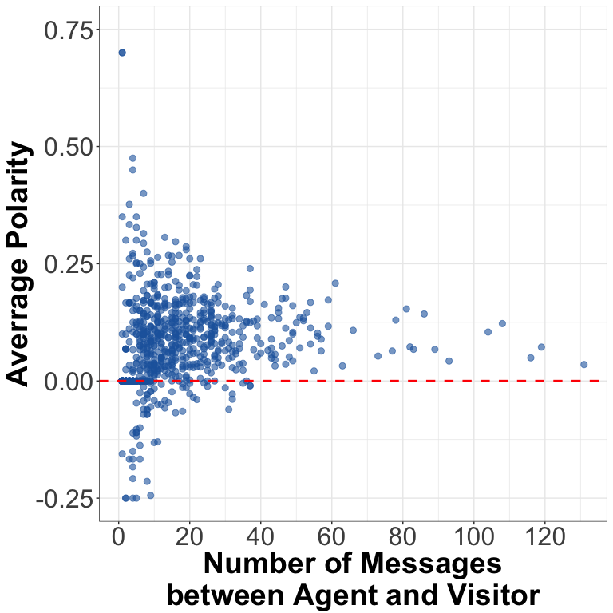
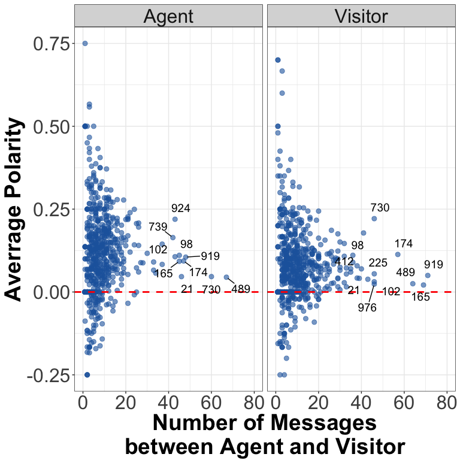

## Goals

The purpose of this report is to correlate polarity (i.e. sentiment of a message) with length of conversation and to distinguish between polarity of messages by "agent" and "visitor". 

## Visualize data

<!-- -->

> Exploring polarity of messages sent by agent and visitor

<!-- -->

