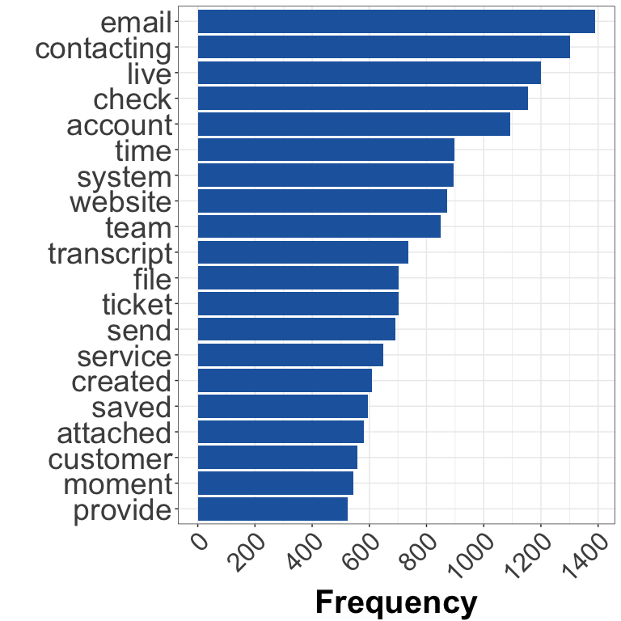

## Goals

The purpose of this document is perform text mining and exploratory analysis on chat sessions provided by Comm100. This includes measuring word frequency, word length, lexical diversity, and lexical density.


## Clean data before tokenization

In this section, 1) contractions, 2) 1-3 character words, 3) stop words, and 4) undesirable words will be removed. Undesirable words include first names, "[Agent]Xx:", "[Visitor]Xx:", "comm100" and "has left the chat" and these will be removed.


## Tokenization using `tidytext` package


```
## [1] 110426      2
```

There are 110426 words in total for 4619 chat sessions.  

## Explore chat sessions that did not pass the filter


```
## [1] " hi raj this is terry with  how may i help you today  visitor the visitor "                             
## [2] " hi tom this is terry with  how may i help you today  visitor the visitor "                             
## [3] " hi terrytest  this is terry with  how may i help you today   tt    cf   visitor the visitor "          
## [4] " hi asdf this is terry with  how may i help you today   asdf   asdf   asdf   hi  visitor the visitor "  
## [5] " hello nick this is norman with  how may i help you today   i am new here   so what are you looking for"
## [6] " hello venkatesh this is norman with  how may i help you today   s"
```

A quick check showed that these chat sessions are typically training sessions or the visitor has left the chat without replying. 

## Word frequency

In this section, the word frequency of each chat session is plotted. 

<!-- -->

Median word frequency per chat session is 18.

## Top words

### What are the top 20 words with the highest frequency? 


```
##             word    N
##   1:       email 1390
##   2:  contacting 1301
##   3:        live 1199
##   4:       check 1155
##   5:     account 1094
##   6:        time  898
##   7:      system  894
##   8:     website  871
##   9:        team  850
##  10:  transcript  736
##  11:        file  703
##  12:      ticket  702
##  13:        send  692
##  14:     service  649
##  15:     created  609
##  16:       saved  596
##  17:    attached  581
##  18:    customer  557
##  19:      moment  545
##  20:     provide  525
##  21:        link  493
##  22:      joined  489
##  23:      agents  473
##  24:    software  461
##  25:       issue  460
##  26:     address  457
##  27:    pleasure  445
##  28:       ahead  441
##  29:       click  433
##  30:        info  431
##  31:        dear  422
##  32:     company  420
##  33:       login  403
##  34:        page  402
##  35:     message  396
##  36:        hold  392
##  37:        site  387
##  38:      assist  367
##  39: information  364
##  40:     correct  363
##  41:      button  356
##  42:        nice  354
##  43:       chats  345
##  44:        free  335
##  45:      online  334
##  46:      create  331
##  47:     details  331
##  48:   questions  328
##  49:      change  325
##  50:     feature  324
##  51:        wait  322
##  52:    business  308
##  53:  understand  304
##  54:     version  301
##  55:  department  287
##  56:       start  287
##  57:      option  279
##  58:   customers  279
##  59:       reach  278
##  60:   marketing  276
##  61:    campaign  275
##  62:      window  273
##  63:      emails  268
##  64:     request  265
##  65:        plan  262
##  66:        auto  252
##  67:    password  248
##  68:    solution  245
##  69:       trial  245
##  70:        fine  245
##  71:     product  233
##  72:        dont  232
##  73:        call  231
##  74:       wrong  226
##  75:    visitors  225
##  76:  screenshot  223
##  77:       phone  220
##  78:        code  220
##  79:        list  219
##  80:       error  210
##  81:     forward  210
##  82:    settings  210
##  83:     alright  209
##  84:  enterprise  206
##  85:       based  206
##  86:     confirm  205
##  87:     checked  201
##  88:        tech  199
##  89:     pricing  198
##  90:      answer  196
##  91:     waiting  196
##  92:      screen  193
##  93:      client  190
##  94:     payment  189
##  95:      update  187
##  96:        data  186
##  97:        talk  185
##  98:      access  184
##  99:     edition  184
## 100:        days  182
##             word    N
```

<!-- -->

### Visualize top 300 words using wordcloud

<!--html_preserve--><div id="htmlwidget-77d6c1f5f63ab580b83f" style="width:768px;height:768px;" class="wordcloud2 html-widget"></div>
<script type="application/json" data-for="htmlwidget-77d6c1f5f63ab580b83f">{"x":{"word":["email","contacting","live","check","account","time","system","website","team","transcript","file","ticket","send","service","created","saved","attached","customer","moment","provide","link","joined","agents","software","issue","address","pleasure","ahead","click","info","dear","company","login","page","message","hold","site","assist","information","correct","button","nice","chats","free","online","create","details","questions","change","feature","wait","business","understand","version","department","start","option","customers","reach","marketing","campaign","window","emails","request","plan","auto","password","solution","trial","fine","product","dont","call","wrong","visitors","screenshot","phone","code","list","error","forward","settings","alright","enterprise","based","confirm","checked","tech","pricing","answer","waiting","screen","client","payment","update","data","talk","access","edition","days","clients","setting","report","current","server","month","rest","technical","hours","console","billing","training","browser","perfect","install","mail","cool","enjoy","received","minutes","receive","chatting","users","image","automatically","checking","query","messages","reports","guide","options","touch","history","offline","chatbot","setup","features","offer","desktop","reply","reached","manager","mobile","multiple","card","sending","charge","stay","hope","price","person","specific","follow","quick","logged","stopping","connect","shot","date","transferred","started","guys","leave","means","afraid","connected","people","accounts","directly","dashboard","cost","paid","issues","platform","yesterday","enable","register","demo","wondering","operators","found","choose","sign","elaborate","canada","transfer","supported","translation","months","yeah","tool","custom","left","upgrade","double","credit","type","integration","form","services","minute","status","happen","remove","changed","process","video","idea","note","hear","office","reset","provider","tomorrow","products","response","enter","related","close","times","package","session","week","talking","select","asap","panel","feel","care","coming","article","computer","prechat","running","reason","google","customize","installed","share","morning","read","real","delay","spam","application","total","excellent","campaigns","mentioned","amount","assign","hour","apologize","text","pull","websites","integrate","control","suggest","developers","chrome","manually","paste","called","sounds","invitation","fixed","added","view","accept","remember","explain","deal","base","pass","refer","line","monitor","contacts","providing","knowledge","charged","shortly","language","requirements","step","default","unable","referring","told","program","ready","meeting","active","guess","invoice","livechat","stop","desk","handle"],"freq":[1390,1301,1199,1155,1094,898,894,871,850,736,703,702,692,649,609,596,581,557,545,525,493,489,473,461,460,457,445,441,433,431,422,420,403,402,396,392,387,367,364,363,356,354,345,335,334,331,331,328,325,324,322,308,304,301,287,287,279,279,278,276,275,273,268,265,262,252,248,245,245,245,233,232,231,226,225,223,220,220,219,210,210,210,209,206,206,205,201,199,198,196,196,193,190,189,187,186,185,184,184,182,182,180,180,178,177,176,174,170,168,167,167,167,166,164,160,157,157,156,154,153,152,152,151,151,150,150,149,148,148,146,143,143,142,141,140,139,139,139,139,136,136,134,134,134,133,132,131,131,130,129,129,129,128,128,127,126,125,125,124,123,122,122,122,121,120,119,119,118,118,117,117,117,116,116,116,115,114,114,113,111,111,111,111,110,108,107,107,107,106,106,106,105,105,105,105,104,104,104,103,103,102,102,102,101,99,97,97,96,96,96,96,96,95,95,95,95,95,94,94,93,93,93,92,92,91,91,91,90,89,89,89,89,88,87,87,87,86,86,85,85,85,85,84,84,84,84,83,83,83,83,83,83,82,82,82,81,81,81,81,81,81,81,81,80,80,80,80,80,79,79,78,78,78,78,77,77,77,76,76,76,75,74,74,74,73,73,73,72,72,72,72,71,71,71,71,70,70,70,70,69],"fontFamily":"Segoe UI","fontWeight":"bold","color":"random-dark","minSize":0,"weightFactor":0.0647482014388489,"backgroundColor":"white","gridSize":0,"minRotation":-0.785398163397448,"maxRotation":0.785398163397448,"shuffle":true,"rotateRatio":0.4,"shape":"circle","ellipticity":0.65,"figBase64":null,"hover":null},"evals":[],"jsHooks":{"render":[{"code":"function(el,x){\n                        console.log(123);\n                        if(!iii){\n                          window.location.reload();\n                          iii = False;\n\n                        }\n  }","data":null}]}}</script><!--/html_preserve-->


